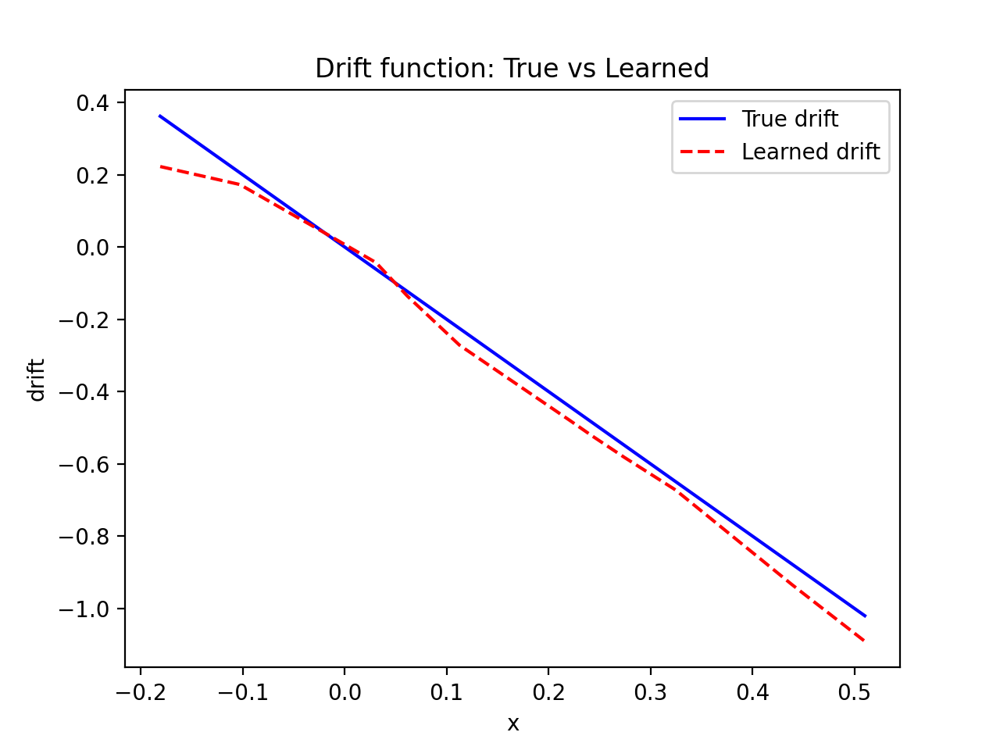
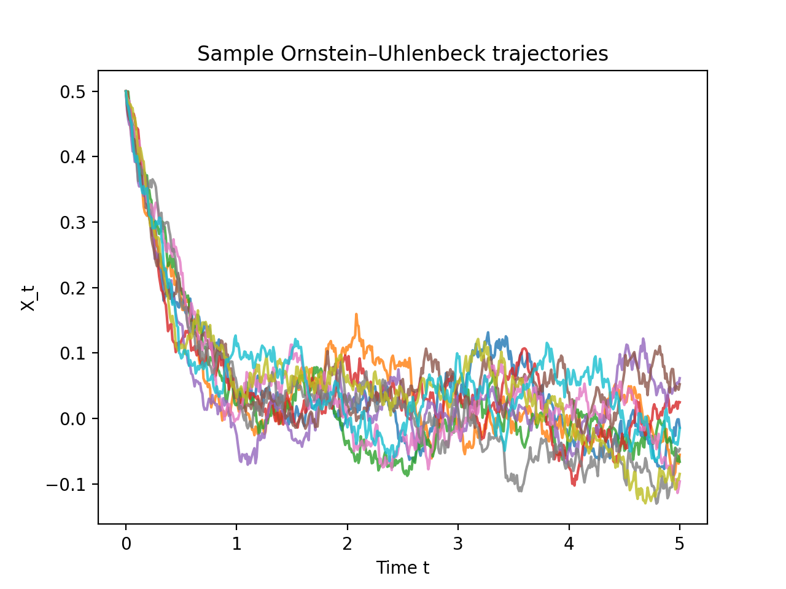

# Learning Drift Functions from SDE Data — Project Report

## Introduction

This project demonstrates how to simulate and learn from stochastic differential equations (SDEs) using Python and PyTorch. It focuses on the **Ornstein–Uhlenbeck (OU) process**, a mean‐reverting stochastic process widely used in quantitative finance, neuroscience and physics. The OU process is governed by the Itô SDE

\[ dX_t = \theta (\mu - X_t)\,dt + \sigma\,dW_t, \]

where \(\theta\) is the mean–reversion rate, \(\mu\) is the long–term mean, \(\sigma\) is the volatility, and \(W_t\) is a standard Brownian motion. The goals of this project are to:

1. **Simulate** sample paths of the OU process numerically using the Euler–Maruyama method.
2. **Estimate** the drift function from simulated data by training a feedforward neural network in PyTorch.
3. **Visualize** the true vs. learned drift and a few sample trajectories.

## Methods

### Simulation of the OU process

The module `sde_simulation.py` implements an `simulate_ou` function that simulates the OU process using the Euler–Maruyama scheme. Given parameters \(\theta, \mu, \sigma\), initial condition \(x_0\), time step size `dt`, number of steps `n_steps` and number of paths `n_paths`, it returns an array of shape `(n_paths, n_steps + 1)` containing the simulated trajectories.

The update rule for each path and time step is

\[ X_{t+\Delta t} = X_t + \theta(\mu - X_t)\,\Delta t + \sigma \sqrt{\Delta t}\,\xi, \]

where \(\xi\) is a standard normal random variable drawn independently for each step and path.

### Preparing training data

To learn the drift function \(\theta(\mu - x)\) from data, we compute finite–difference approximations to the time derivative of the process. For each simulated trajectory, the approximate derivative at step \(n\) is

\[ \frac{X_{n+1} - X_n}{\Delta t}. \]

We pair each derivative with the state \(X_n\) at which it was computed. Flattening all sample paths yields a training data set of pairs `(x, dx_dt)`.

### Neural network training

The script `train_nn.py` constructs and trains a small feedforward neural network using PyTorch. The network architecture is

```python
model = torch.nn.Sequential(
    torch.nn.Linear(1, 64),
    torch.nn.ReLU(),
    torch.nn.Linear(64, 64),
    torch.nn.ReLU(),
    torch.nn.Linear(64, 1)
)
```

The input is a single scalar \(x\) and the output is the model's prediction of the derivative \(dX_t/dt\). We train with mean–squared error loss and the Adam optimizer for 500 epochs. The training data contains 20 sample paths, each with 500 time steps and time step size \(\Delta t = 0.01\). Volatility is set to \(\sigma = 0.1\) to keep the derivative estimates relatively noisy but learnable.

### Visualization

After training, we evaluate the learned drift function on a grid of \(x\) values and compare it against the true drift \(\theta(\mu - x)\). We also plot 10 sample trajectories from the simulated OU process. The figures are saved in the `figures/` directory:

- **`drift_fit.png`** – True drift (blue) vs. learned drift (red dashed).
- **`trajectories.png`** – Ten sample OU trajectories illustrating mean–reversion.

## Results

The training loss decreased steadily during optimization and reached a value around 1.01, indicating the model captured much of the deterministic drift despite stochastic noise. The plot of the learned vs. true drift shows that the neural network has learned a reasonably accurate linear relationship:



The learned drift (red dashed line) closely tracks the true drift (blue solid line) across the range of states visited during simulation. Discrepancies increase near the boundaries, which is expected given limited data in those regions.

The simulated trajectories illustrate the mean–reverting behavior of the OU process: starting from 0.5, all paths decay towards the long–term mean \(\mu = 0\) with noisy fluctuations:



## Conclusion

This project demonstrates how to simulate a stochastic differential equation, prepare training data from finite–difference derivatives, and train a neural network to learn the drift function. Even with simple architectures and modest data, the network accurately reproduces the deterministic part of the dynamics. This workflow can be extended to more complex SDEs or used as a component in data–driven modeling and control of stochastic systems.

## Next steps

Potential extensions include:

1. Estimating both drift and diffusion parameters simultaneously by formulating a suitable loss (e.g., negative log–likelihood).
2. Exploring other SDEs, such as geometric Brownian motion or stochastic volatility models.
3. Using neural networks to learn nonlinear drift functions beyond the linear OU drift.
4. Reducing the noise in the derivative estimates by smoothing or using longer time steps.